## Heroku

En éste pequeño artículo hablaremos sobre la plataforma en la nube llamada Heroku. Así como un pequeño tutorial donde veremos como deployar tu primera aplicación en Heroku. **Importante: Ésto lo haremos con el lenguaje de programación *Python V3.8***

### ¿Qué es Heroku?

Heroku es una plataforma de servicio de computación en la nube, ésta te permitirá, *en pocos pasos*, alojar tu código y permitir *deplyarlo* (desplegarlo en un servidor).

Heroku hacce énfasis en que necesitarás pocos pasos, ya que no es necesario configurar todos los pasos de un servidor a gran escala.

### ¿Cómo funciona Heroku?

Heroku funciona través de *Dynos*, estos *Dynos*, no son mas que pequeños contenedores, los cuales permiten a tu aplicación - Servicio, poder desplegarse ccon facilidad, seguridad y bajo la configuración que tu le digas. Todos estos *Dynos*, están basados en un UNIX y mas exáctamente en un sistema de tipo Debian

De manera análoga, Heroku, provee de una interfaz de mantenimiento en su página web, lo que hace posible que la administración del mismo sea manejable de mejor manera.

### ¿Que puedo hacer en Heroku

Heroku nos ofrece varios servicios que nos pueden ayudar en nuestra aplicación, a continuación se describen algunos de ellos:

- Heroku app:
- Heroku Postgress:
- Redis To go:
- Redis Enterprise Cloud
- Apache Kafka
- SFTP to go
- MSSQL
- Buketeer
- JawsDB MySQL

Cada una de éstas tecnologías son configurables desde la interfaz web de heroku, o bien desde línea de comandos en la terminal

### Mis primeros Pasos en Heroku

Para este tutorial es importante aclarar que se hará una API, ésto con ayuda del lenguaje de programación Python.

#### 1.- Crear cuenta en Heroku

Lo primero que necesitaremos será crear una cuenta en la plataforma de [Heroku](https://www.heroku.com), en ella te pedirá llenar algunos datos de información personal. 

**NOTA: Si es tu primera vez trabajando con heorku te recomiendo poner en el campo *Company Name* la palabra *UNAM* y en *Role* el campo *Student* o bien *Hobbyst***

Para éste caso se pondrá *python* como lenguaje de programación principal **Aunque esto no significca que sólo construiremos aplicaciones en éste lenguaje, es sólo un parámetro para Heroku**

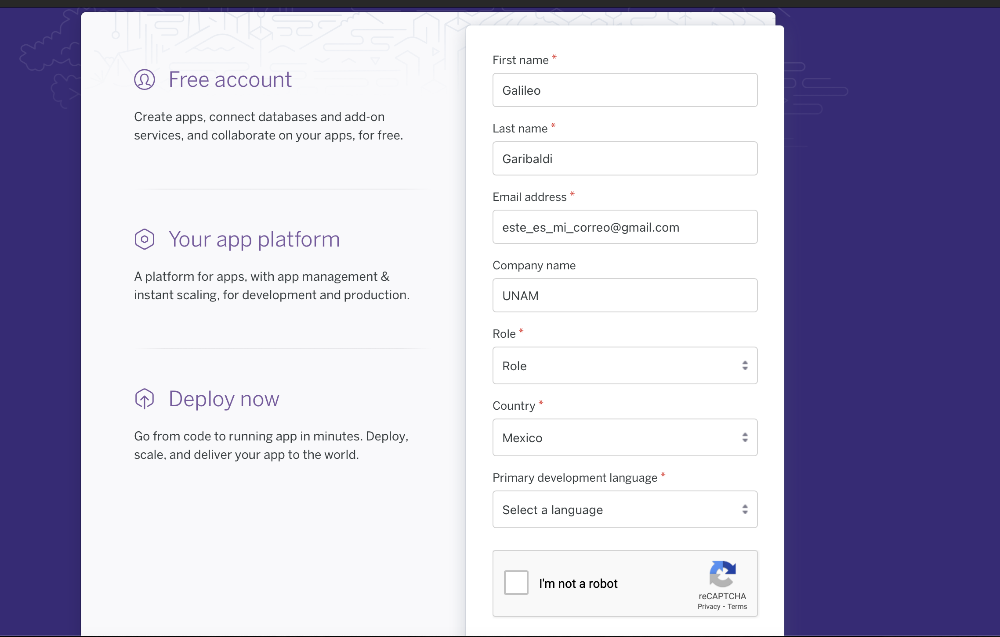

Posterior a esto, te pedirá confirmar tu correo electrónicco.

**NOTA: Heroku te pedirá ingresar una tarjeta de pago, esta puede ser de Débito o crédito, pero no se te hará ningún pago o coste, puedes estar tranquilo de que no se te cobrará al menos que así lo desees.**

#### 2.- Configurando Python

Ya que tenemos nuestra cuenta creada, crearemos un entorno virtual de python con las siguientes líneas de comando

```bash
pip3 install venv
python3 -m venv entorno
source entorno/bin/activate
pip install --upgrade pip
```

De esta forma conseguiremos estar en un pequeño entorno virtual, el cual es como una burbuja dentro de python, el cual nos permite configurar la máquina virtual de python. Para mayores referencias, consultar el siguiente [enlace](https://docs.python.org/es/3/tutorial/venv.html)

Una vez teniendo configurado nuestro entorno virtual, proccederemos a instalar las librerías necesarias, éstas se describen a continuación

1. Flask: Framework de mini Aplicaciones Web

   1. ```bash
      pip3 install flask
      ```

2. Gunicorn: Librería de interacción con Heroku

   1. ```bash
      pip3 install gunicorn
      ```

3. Psycopg2: Librería interna para el manejo de *Postgres*

   1. ```bash
      pip3 install psycopg2
      pip3 install psycopg2-binary
      ```

4. Pandas: Librería para el manejo de datos

   1. ```
      pip3 install pandas
      ```

5. Requirements.txt: Esta no es una librería, si no un archivo de configuración que creareamos con los siguientes comandos:

   1. ```bash
      pip3 freeze > requirements.txt
      ```

      Este Archivo nos servirá para la configuración en heroku, este contiene las librerías y configruaciones que hemos hecho hasta ahora. **Importante: Cada vez que se instale una nueva librería, éste archivo deberá actualizarse, escribiendo el comando anteriormente mencionado**

#### 3.- Empezamos a codificar

##### 3.1 Primeros pasos

Una vez que tenemos todo listo, es hora de empezar a codificar. 

Lo primero que haremos será crear nuestra aplicación de forma sencilla y correrla en el navegador

```python
from flask import Flask
##Importamos la librería Flask
app = Flask(__name__)
##Creamos nuestra app

##Creamos nuestro primer decorador, lo que nos permite crear la ruta principal "/"
@app.route("/")
def hello():
    ##Le decimos a nuestra función que retorne "Hola mundo"
    return "Hola mundo"

if __name__ == "__main__":
    app.run(debug=True,port=5003)
```

¡De esta forma ya tenemos nuestra primera aplicación corriendo desde flask! Puedes checarlo tu mismo llendo a este enlace: http://127.0.0.1:5003, el cual es tu localhost

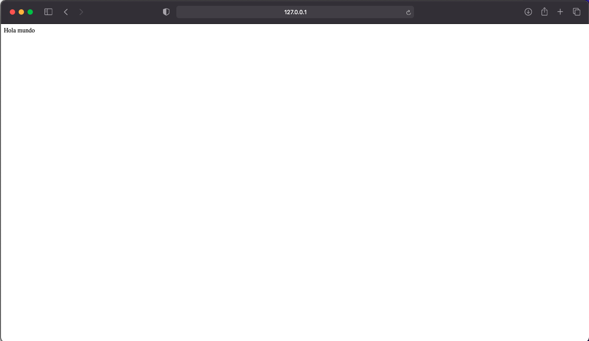

Sin embargo esto es aún muy poco útil, por lo que procederemos a poner un poco de sabor a las cosas

##### 3.2 Configurando Templates

Hasta ahorita sólo tenemos algunos pocos archivos, **Nota: El archivo se debe llamar *requirements.txt***

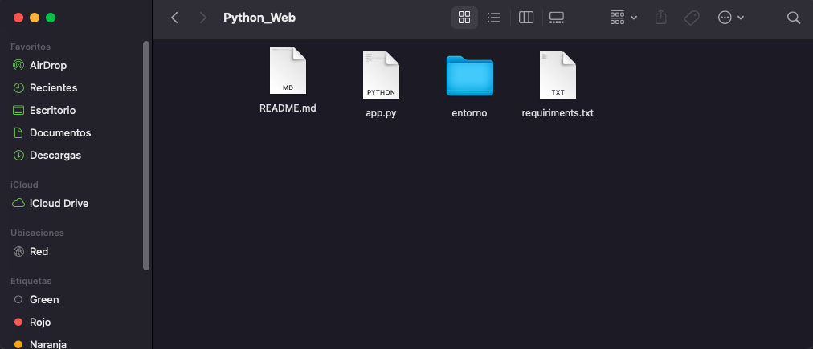

Para este ejemplo implementaremos el modelo Vista - Controlador, por lo que crearemos 3 directorios mas

- Controllers: En este Directorio irá toda la configuración hacía la Base de datos **(Controlador)**

- static: En este directorio irá toda la configuración de archivos estáticos, tales como *css*, *js* o bien imágenes, se recomienda tener la siguiente jerarquía **(Vista)**

  - css
  - img
  - js

  **Vista de las carpetas dentro de static**

- templates: En este directorio se encuentran todos los archivos de tipo *.html* y plantillas **(Vista)**

**Vista de los archivos**

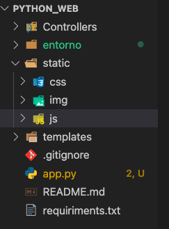

Para este caso crearemos un archivo llamado **layout.html** dentro de la carpeta *templates*, el cual contendrá el contenido del siguiente [enlace](https://github.com/galigaribaldi/Python_Web/blob/heroku-proof/templates/layout.html).

Una vez teniendo nuestro **layout.html**, lo que haremos será crear una vista principal para nuestra api, esto lo lograremos poniendo un archivo dentro de nuestra carpeta **templates** llamado *index.html*.

```html
 
<br><br><br><br><br><br>
<h1> Inicio </h1>
<br><br><br><br><br> 

```

**NOTA:** Quizás te estés preguntando por que este archivo luce tan raro, esto se debe a que se usó el archivo *layout.html*, como plantilla para poder heredarlo en el archivo *index.html*, este nos permite escribir menos código.

Una vez teniendo estas configuraciones del lado del front, empezaremos a configurar el archivo en el controlador, es decir el archivo *app.py*

```python
from flask import Flask
##Importamos la librería Flask
from flask import request, render_template, url_for

app = Flask(__name__)
##Creamos nuestra app

##Creamos nuestro primer decorador, lo que nos permite crear la ruta principal "/"
@app.route("/")
def hello():
    ##Le decimos a nuestra función que retorne el template index.html
    return render_template("index.html")
  
###Segunda ruta API
@app.route("/api")
def api():
    return "API"
if __name__ == "__main__":
    app.run(debug=True,port=5003)
```

##### 3.3 Configurando nuestra ruta de API

Para este ejemplo usaremos una API de películas, está API tendrá la siguiente estructura:

1. ID Película: Tipo de dato numérico, *int-integer*
2. Nombre Película: Tipo de dato Cadena, *str, character varying*
3. Nombre del director: Tipo de dato Cadena de texto, *str, character varying*
4. Actores principales: Tipo de dato Cadena de texto, *str, character varying*
5. Año de lanzamiento: Tipo de dato Cadena de texto, *str, character varying*
6. Trama: Tipo de dato Cadena de texto, *str, character varying*
7. Imagen de portada: Tipo de dato Cadena de texto, *str, character varying*

En python tenemos un tipo de dato que se asemeja al *JSON*, el cual son los diccionarios, su estructura es básicamente *llave-valor*

```python
### De esta forma crearemos un diccionario con 1 solo dato
dicccionario = {
        "ID": 1,
        "Nombre_Pelicula": "Amelie",
        "Nombre_director":"Jean-Pierre Jeunet",
        "Actores_principales":"Audrey Tautou, Mathieu Kassovitz",
        "anio_lanzamiento":"2001",
        "trama":"""Amelie no es una chica como las demás.
                Ha visto a su pez de colores deslizarse hacia las alcantarillas municipales, 
                a su madre morir en la plaza de Notre-Dame y a su padre dedicar todo su afecto a un gnomo de jardín. 
                De repente, a sus veintidós años, descubre su objetivo en la vida: arreglar la vida de los demás. 
                A partir de entonces, inventa toda clase de estrategias para intervenir, sin que se den cuenta,
                en la existencia de varias personas de su entorno."""
    }
```

Configuraremos nuestro archivo de *app.py*, para que pueda mandar este diccionario como un archivo Json, ésto lo haremos con la librería *jsonify*.

```python
from flask import Flask
##Importamos la librería Flask
from flask import request, render_template, url_for
from flask import jsonify
app = Flask(__name__)
##Creamos nuestra app

##Creamos nuestro primer decorador, lo que nos permite crear la ruta principal "/"
@app.route("/")
def hello():
    ##Le decimos a nuestra función que retorne "Hola mundo"
    return render_template("index.html")

@app.route("/api")
def api():
    dicccionario = {
        "ID": 1,
        "Nombre_Pelicula": "Amelie",
        "Nombre_director":"Jean-Pierre Jeunet",
        "Actores_principales":"Audrey Tautou, Mathieu Kassovitz",
        "anio_lanzamiento":"2001",
        "trama":"""Amelie no es una chica como las demás.
                Ha visto a su pez de colores deslizarse hacia las alcantarillas municipales, 
                a su madre morir en la plaza de Notre-Dame y a su padre dedicar todo su afecto a un gnomo de jardín. 
                De repente, a sus veintidós años, descubre su objetivo en la vida: arreglar la vida de los demás. 
                A partir de entonces, inventa toda clase de estrategias para intervenir, sin que se den cuenta,
                en la existencia de varias personas de su entorno."""
    }
    return jsonify(dicccionario)
if __name__ == "__main__":
    app.run(debug=True,port=5003)
```

Si nos vamos a la ruta http://127.0.0.1:5003/api, podremos visualizar nuestro resultado

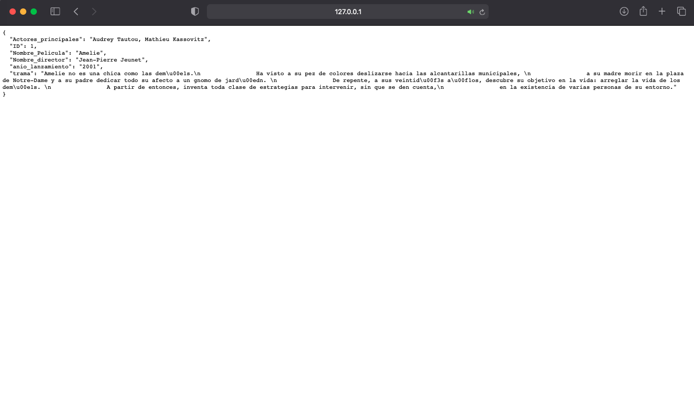

##### 3.4 Configurando nuestra BD en Postgres Heroku

Para este punto nos iremos a la pantalla principal de heroku y daremos en **New** y en **Create a New App**

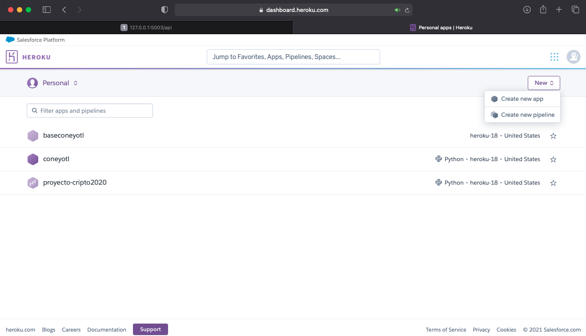

Pondremos de nombre *appdiplomado* y elegiremos como region USA.

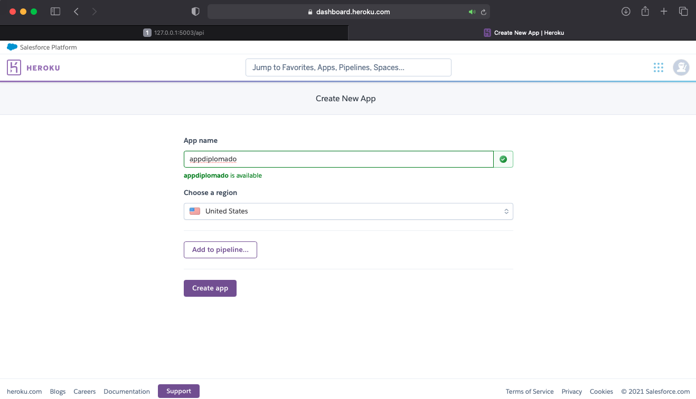

Esto nos mandará a la pantalla principal de Heroku y nos dará la opción de elegir un deployamiento (subir nuestro código a la nube), pero para este punto sólo elegiremos el menú de **Resources** y después **Find More add-ons**

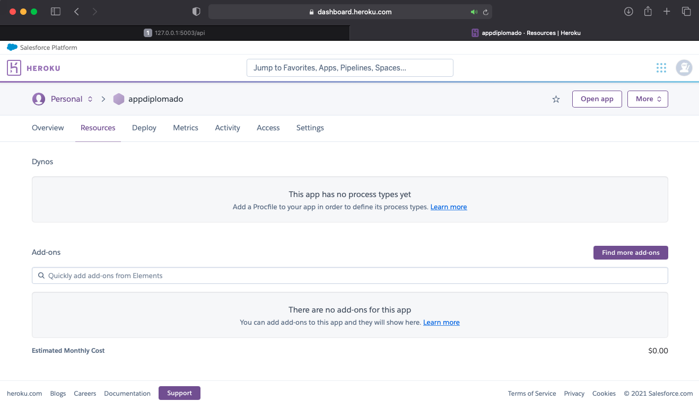

Esto nos mandará a otra pantalla y bajaremos un poco hasta encontrar **Heroku Postgres** y después **Install Heroku Postgres**

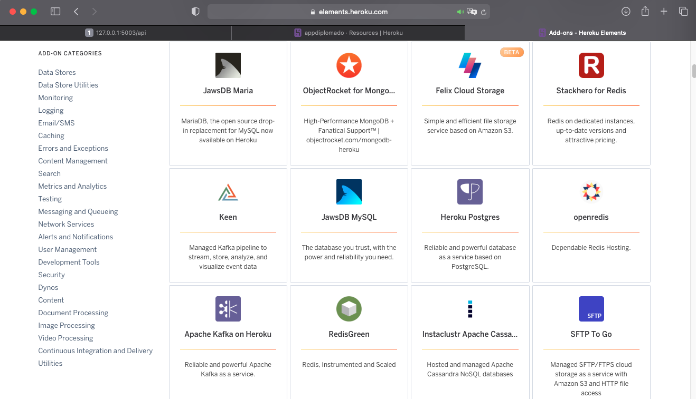

Finalmente nos aparacerá un menú donde elegiremos la app donde la pondremos y elegiremos el nombre de nuestra app, en este caso **appdiplomado** y elegir el plan **HobbyDev**, este nos dará un plan gratis con la capacidad de almacenar 10,000 registros, finalmente, damos en **Submit Order Form**

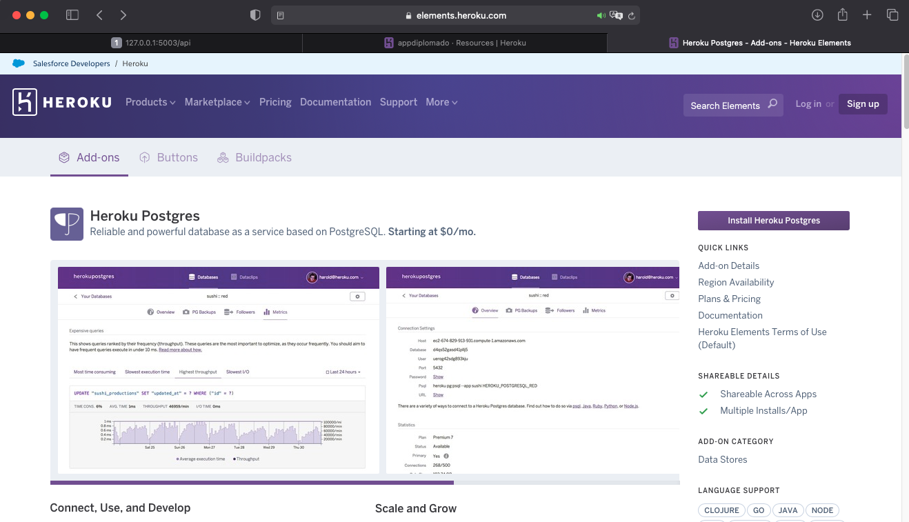

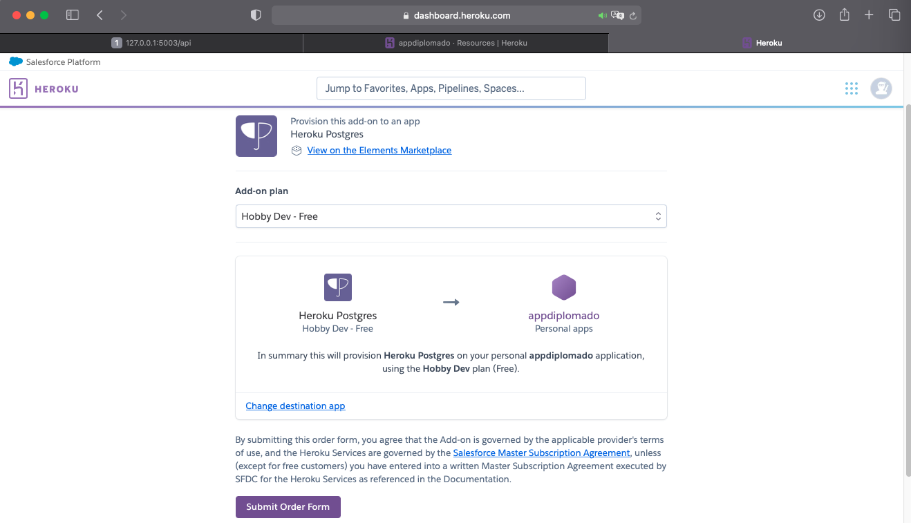

Nos aparecerá la pantalla principal y daremos click en heroku postgress

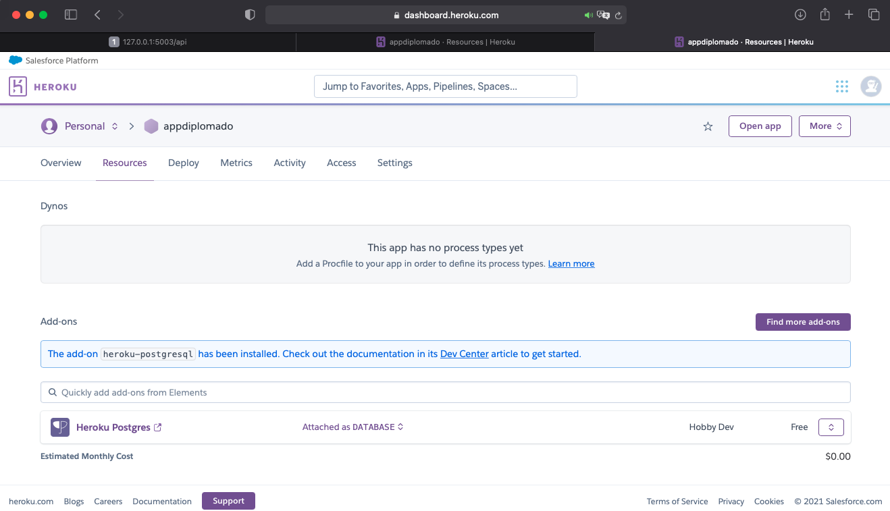

Esto nos saltará al menú de la base, aquí nos iremos al menú **settings** y aquí tomaremos las claves de nuestra base y daremos click en **View Credentials**

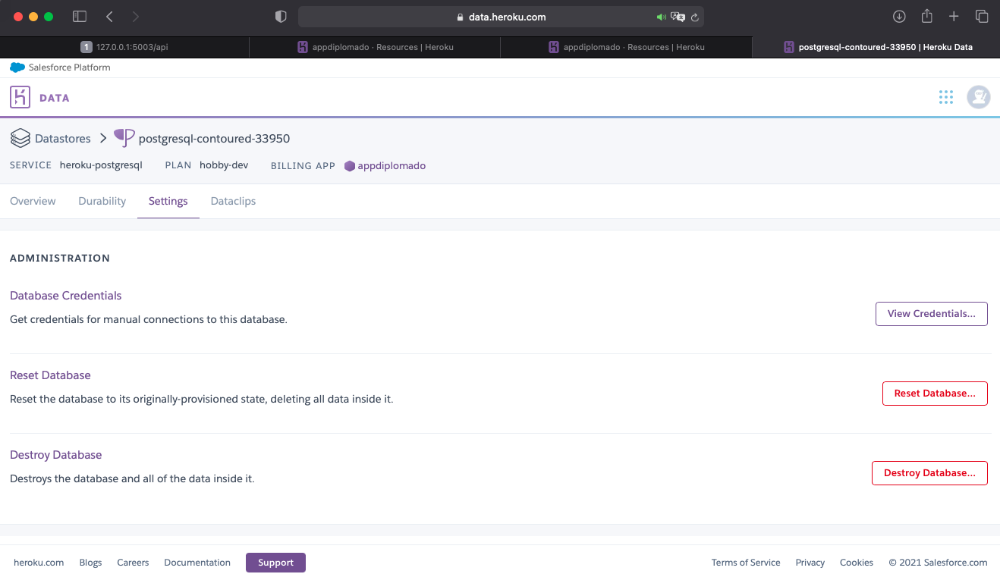

De aquí tomaremos los siguientes datos

- Host
- Database
- User
- Port
- Password

**Importante:** Estas credenciales en el plan *hobby dev*, no son permamemtes, por lo que es importante revisar constantemente que estas sean válidas.

##### 3.5 Configurando el acceso a nuestra base en Python

Ahora nos concentraremos en conectar la base de datos con nuestro código de python, esto lo haremos con ayuda del módulo *psycopg2*

Nos iremos a la carpeta *Controllers* y aquí crearemos un archivo llamado *modelsCreation.py* y otro llamado *modelsOperation.py*, para el primer archivo llamado *modelsCreation.py*, en el crearemos las tablas necesarias para crear nuestra API.

**En el siguiente código de modelsCreation.py, en el crearemos 3 funciones principales:**

- Creación de la base: Nombre de la función *creacion_base*
  - Entrada: NULL, no recibe argumento
  - Proceso: Crear la tabla **pelicula**, en la base datos
  - Salida: Null, hay argumentos de salida
- Inserción de registros:
  - Entrada: Tupla con el registro a insertar
  - Proceso: Inserción de datos en la BD
  - Salida: NULL
- Eliminar Tablas:
  - Entrada: Null
  - Proceso: Borrar tablas
  - Salida: Null

```python
# -*- coding: utf-8 -*-
import psycopg2
###################     Credenciales de la base       #####################
host = 'Host'
database = 'NombreDelaBase'
user = 'Usuario'
password = 'Password'
def creacion_base():
    conexion = psycopg2.connect(host=host, database=database, user=user, password=password)
    cursor = conexion.cursor()
    cursor.execute("""CREATE TABLE pelicula(
	                    movie_id serial PRIMARY KEY,
                    	movie_name character varying(100),
                    	director_name character varying(100),
                        principals_actors character varying(200),
                        movie_year character varying(100),
                        trama_movie character varying(400)
                    );
                   """)
    conexion.commit()
    cursor.close()
    conexion.close()
    
def insercion_datos(tupla):
    conexion = psycopg2.connect(host=host, database=database, user=user, password=password)
    cursor = conexion.cursor()
    cursor.execute("""INSERT INTO pelicula(movie_name,director_name, principals_actors,movie_year,trama_movie)
                   VALUES """+str((tupla)))
    conexion.commit()
    cursor.close()
    conexion.close()
    
def eliminar_Tablas():
    conexion = psycopg2.connect(host=host, database=database, user=user, password=password)
    cursor = conexion.cursor()
    cursor.execute("""DROP TABLE pelicula;
                   """)
    conexion.commit()
    cursor.close()
    conexion.close()
```

**Para el archivo modelsOperation.py, crearemos una función que traiga todos los registros, en este caso usaremos, la ayuda de módulo pandas para convertirlo en JSON**

```python
# -*- coding: utf-8 -*-
import psycopg2
import pandas as pd
###################     Credenciales de la base       #####################
host = 'host'
database = 'db'
user = 'user'
password = 'contraseña'

def consulta():
    query = "SELECT * FROM pelicula;"
    datos = pd.read_sql(query, con=psycopg2.connect(host=host, database=database, user=user, password=password))
    datos = datos.to_json()
    return datos
```


##### 3.6 Configurando las rutas de nuestra API

En este punto está casi todo listo, agregaremos un par de rutas, las cuales harán posible la consulta hacía la API y la creación y/o eliminación de dicha tabla:

- Creación **(/api/CreacionTabla)**: En esta ruta importaremos la función *creacion_base()*, esta se hará posible poniendo las siguientes líneas de código:

  - ```python
    ###Importacion de la base
    import Controllers.modelsCreation as crear
    ### Crear base
    crear.creacion_base()
    ```

- Eliminar **(/api/EliminarTabla)**: Eliminar todas las tablas, **Importante: Esto eliminará todos los registros**

  - ```python
    ##Eliminar tablas
    crear.eliminar_Tablas()
    ```

- Insertar **(/api/Insert/register/<movie_name>/<director_name>/<principals_actors>/<movie_year>/<trama_movie>)**: En esta ruta tenemos que pasarle los siguientes parámetros:

  - Nombre de la película - **movie_name**: Este tipo de dato es *String*

  - Director Principal - **director_name**: Este tipo de dato es *String*

  - Actor principal - **principals_actors**: Este tipo de dato es *String*

  - Año de la película - **movie_year**: Este tipo de dato es *String*

  - Trama de la película - **trama_movie**: Este tipo de dato es *String*

    - En esta sección, se necesita pasarle por medio de la URL los parámetros, y después leerlos con ayuda de la librería *request*

    - Por último, se redirigirá a la ruta *api*, la cual se define a continuación

    - ```python
      @app.route("/api/Insert/register/<movie_name>/<director_name>/<principals_actors>/<movie_year>/<trama_movie>")
      def inserts(movie_name,director_name, principals_actors,movie_year,trama_movie):
          ###Leer datos
          movie_name = request.args.get('movie_name',movie_name)
          director_name = request.args.get('director_name',director_name)
          principals_actors = request.args.get('principals_actors',principals_actors)
          movie_year = request.args.get('movie_year',movie_year)
          trama_movie = request.args.get('trama_movie',trama_movie)
          ####CConvertir datos a tuplas
          tupla = (movie_name,director_name, principals_actors,movie_year,trama_movie)
          ###Meter datos
          crear.insercion_datos(tupla,)
          return redirect(url_for('api'))  
      ```

- Ver **(/api)**: En esta ruta se hará una consulta a la BD y se retornará un JSON

  - ```python
    @app.route("/api")
    def api():
        dicccionario = operaciones.consulta()
        return dicccionario
    ```

A cotinuación se presenta todo el código

```python
from flask import Flask
##Importamos la librería Flask
from flask import request, render_template, url_for,redirect
from flask import jsonify
##
import Controllers.modelsCreation as crear
##
import Controllers.modelsOperations as operaciones
app = Flask(__name__)
##Creamos nuestra app

##Creamos nuestro primer decorador, lo que nos permite crear la ruta principal "/"
@app.route("/")
def hello():
    ##Le decimos a nuestra función que retorne "Hola mundo"
    return render_template("index.html")

@app.route("/api")
def api():
    dicccionario = operaciones.consulta()
    return dicccionario

@app.route("/api/CreacionTabla")
def creacion():
    crear.creacion_base()
    return "Tablas Creadas Listo!"

@app.route("/api/EliminarTablas")
def eliminar():
    crear.eliminar_Tablas()
    return "Tablas Eliminadas"

##/api/Insert/register/Amelie/Jean_Pierre_Jeunet/Audrey_Totou/2001/El_fabuloso_destino_de_Amelie
##/api/Insert/register/Requiem_for_a_dream/Darren_Afronosky/Jared_Leto/2001/_
##/api/Insert/register/It/Darren_Afronosky/Jared_Leto/2001/_
@app.route("/api/Insert/register/<movie_name>/<director_name>/<principals_actors>/<movie_year>/<trama_movie>")
def inserts(movie_name,director_name, principals_actors,movie_year,trama_movie):
    ###Leer datos
    movie_name = request.args.get('movie_name',movie_name)
    director_name = request.args.get('director_name',director_name)
    principals_actors = request.args.get('principals_actors',principals_actors)
    movie_year = request.args.get('movie_year',movie_year)
    trama_movie = request.args.get('trama_movie',trama_movie)
    ####CConvertir datos a tuplas
    tupla = (movie_name,director_name, principals_actors,movie_year,trama_movie)
    ###Meter datos
    crear.insercion_datos(tupla,)
    return redirect(url_for('api'))  
if __name__ == "__main__":
    app.run(debug=True,port=5003)
```

A continuación se presenta la salida de la API

#### 4.- Subiendo mi proyecto a Heroku

Hasta ahorita, tenemos la siguiente estructura de archivos

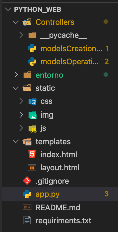

Para poder subir nuestro proyecto a heroku, necesitaremos los siguientes archivos:

1. Archivo de funcionamiento (código en Python):

   1. En este caso, el archivo de funcionamiento principal es nuestro archivo **app.py**

2. Archivo de requerimientos (Archivo *.txt*):

   1. Este archivo es el que generamos en la sección 2, sin embargo puedes volver a generarlo o actualizarlo con el comando:

      ```python
      pip3 freeze > requirements.txt.txt
      ```

3. Archivo de configuración (*Procfile*): Archivo de configuración que usará heroku para saber quee *dyno* o que arhcivo debe correr como principal

   1. ```shell
      echo "web: gunicorn app:app" > Procfile
      ```

      Esto generará un archivo sin extensión de nombre **Procfile**, el cual debe de contener como única línea *web: gunicorn app:app*

4. Entorno Virtual a usar (*carpeta generada con venv*): Este entorno es la carpeta de configuración que anteriormente ya hicimos.

Una vez teniendo todos los archivos listos, nos dirigiremos a nuestra cuenta de Heroku y nos iremos al menú **Deploy**, es importante tener en cuenta unas cuantas cosas

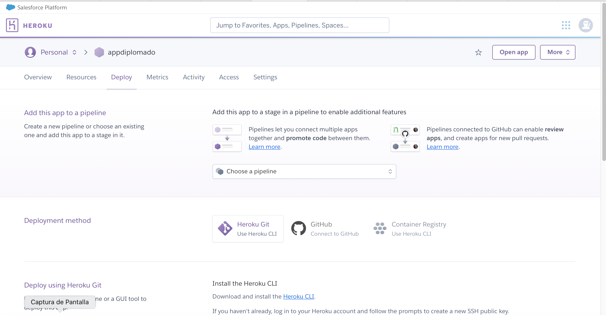

##### 4.2 Instalando Heroku en nuestra computadora

Necesitaremos una instalación de Heroku CLI, el cual básicamente, es un cliente de heroku con el cual podremos deployar nuestro proyecto. Para ello, dejaré el enlace de instalación [Enlace Descarga - Instalación Heroku](https://devcenter.heroku.com/articles/heroku-cli).

##### 4.3 Heroku Git (Con ningún repositorio creado)

En esta opción asumimos o decimos que no tenemos una cuenta de github con nuestro nombre o bien, decidimos que nuestro código no se alojará en Github, si este es el caso, Heroku nos proporcionará un reposotior externo cone l único fin de poder Deployar nuestro proyecto.

```
git init
heroku git:remote -a appdiplomado
git add .
git commit -am "make it better"
git push heroku master
```

##### 4.4 Heroku Git - Github (Teniendo un repositorio Creado)

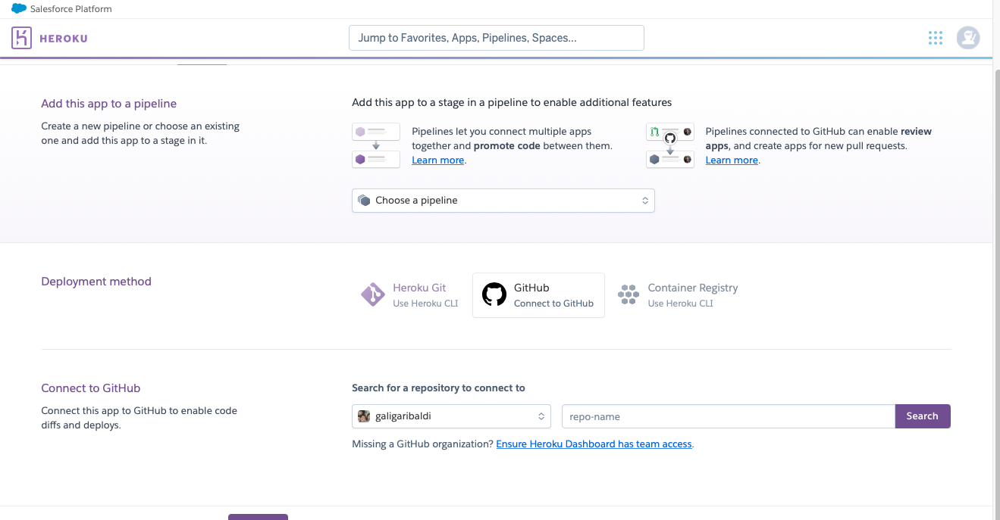

La opcón mas recomendable es tener un repositorio en Github previamente cargado, lo que hará esta opción, será ligar una de nuestras ramas de Github (recomendablemente la master) a nuestro alojamiento en heroku, de manera tal, que si *commiteamos y pusheamos* a nuestro repo, este tambiñen se actualziará en nuestra app de heroku

En este caso nis iremos a el apartado *Github Connect to Github* y elegiremos el repsositorio y la rama que querramos

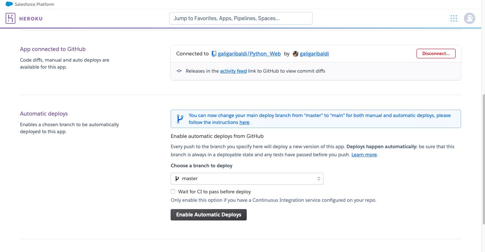

Después elegiremos la rama a la cual estará asociado y por último daremos en **Enable Automatic Deploys**

**Opcion 1: **Lo último que haremos será commitear y pushear un cambio a nuestra app

```shell
git add .
git commit -m "Deploy to Heroku"
git push
```

**Opcion 2:** Podemos bajar y darle en *Deploy Manually* y procederá a hacer Deploy

##### 4.5 Errores posibles durante el Deploy

Si lllega a ocurrir un error duramte el deploy, es importante checar lo siguiente:

1. Tener a la misma altura los archivos de *app.py*, *Procfile*(sin extension) y *requiriments.txt*

2. En caso de que el error nos salte que no puede encontrar una versión de Python, teclear los siguientes comandos

   1. ```shell
      heroku buildpacks:set heroku/python
      heroku buildpacks:set heroku/python --app appdiplomado
      git push heroku main
      ```

   2. O bien, irse a la interfaz gráfica en el menú de settings (Página web de Heroku) y configurar un python package

      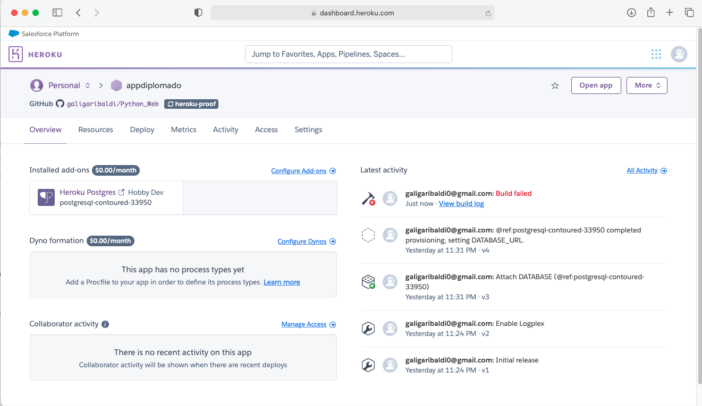

      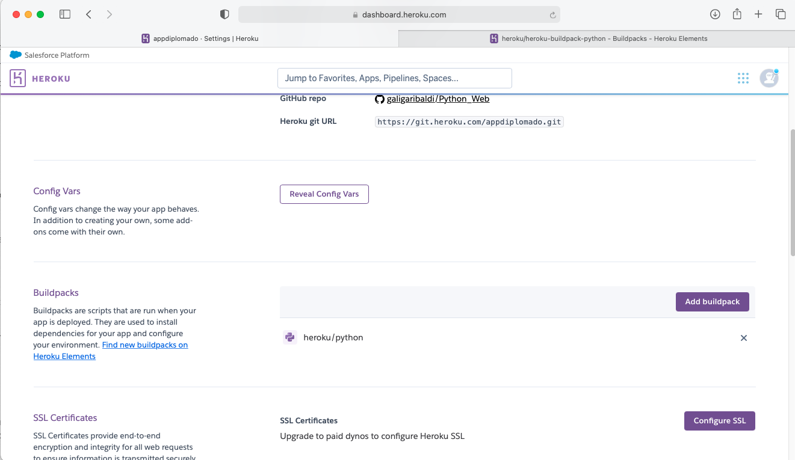

   3. Una vez hecho este cambio nos dirigiremos a las opciones Deploy y volveremos a deployar

#### 5.- Referencias

##### Código de Github

El código se ha hecho parte por parte y se encuentra en el siguiente enlace, si gustas puedes mejorarlo. ¡Eres bienvenido!

https://github.com/galigaribaldi/Python_Web/tree/Deploy-Heroku

##### Liga de Heroku

El código se encuentra corriendo en el siguiente enlace: https://appdiplomado.herokuapp.com

##### Referencias Externas

- [Entornos Virtuales](https://docs.python.org/es/3/tutorial/venv.html)
- [Agregar Utilidades a Heroku](https://devcenter.heroku.com/categories/add-ons)
- [Documentación Oficial de Heroku](https://devcenter.heroku.com/categories/reference)
- [Documentación Flask](https://flask.palletsprojects.com/en/2.0.x/)
